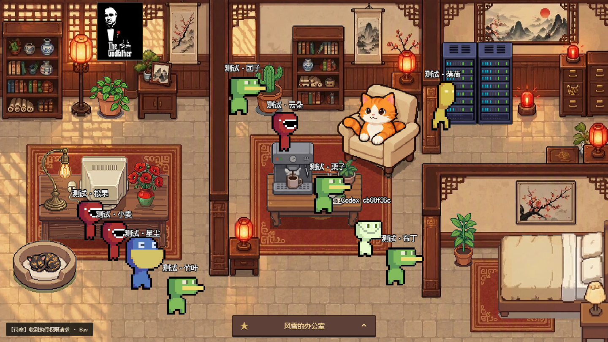
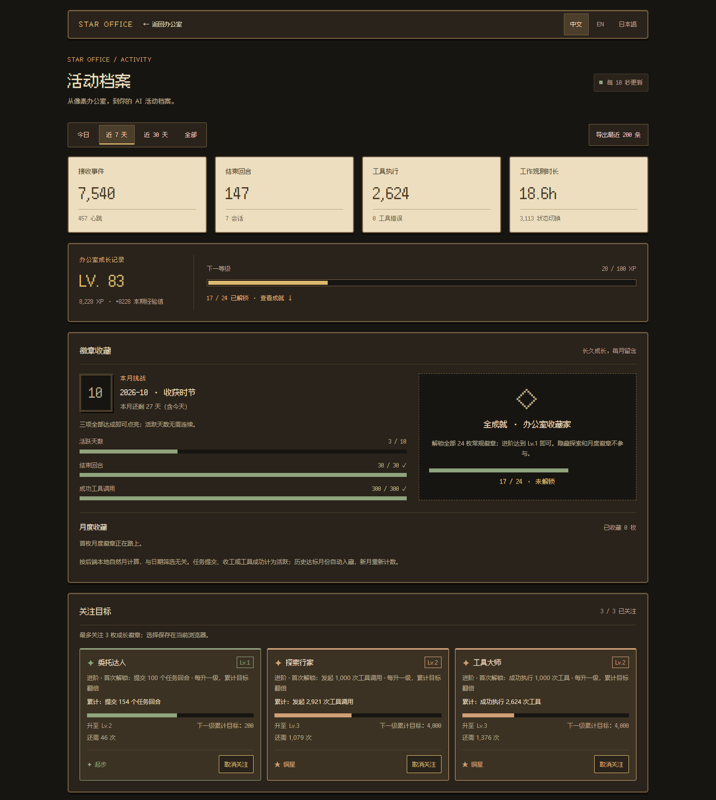

# Star Office UI

🌐 Language: [中文](./README.md) | [English](./README.en.md) | **日本語**



**ピクセルアート風 AI オフィスダッシュボード** —— AI アシスタントの作業状態をリアルタイムで可視化し、「誰が何をしているか」「最近何をしたか」「今オンラインか」を直感的に把握できます。

マルチ Agent 協調、中英日 3 言語、AI 画像生成による模様替え、デスクトップペットモードに対応。
推奨の接続方法は **Codex hooks**。キャラクターの状態を自動更新し、セッション、ツール、子 Agent の活動を記録します。他の AI Agent もスクリプトや HTTP API で接続できます。

本バージョンは [ringhyacinth/Star-Office-UI](https://github.com/ringhyacinth/Star-Office-UI) を基に改修しています。開発とデプロイには [oiuv/Star-Office-UI](https://github.com/oiuv/Star-Office-UI) を使用してください。

> 元のプロジェクトは **[Ring Hyacinth](https://x.com/ring_hyacinth)** と **[Simon Lee](https://x.com/simonxxoo)** の共同制作（co-created project）であり、コミュニティの開発者（[@Zhaohan-Wang](https://github.com/Zhaohan-Wang)、[@Jah-yee](https://github.com/Jah-yee)、[@liaoandi](https://github.com/liaoandi)）とともに継続的にメンテナンス・改善を行っています。
> Issue や PR を歓迎します。貢献してくださるすべての方に感謝いたします。

---

> ブラウザー版は全画面表示です。下部のオフィス名から最近のメモ、訪問者、模様替え、活動記録、設定を開きます。Codex の子 Agent はキーなしで自動参加し、終了後はオフライン、最後のイベントから 5 分で非表示になります。Python での直接起動は `.env` を読み込みません。環境変数はシェルやサービス管理ツールで設定してください。配布用は `frontend/office-agent-push.py`（`requests` が必要）、ルートの同名スクリプトは毎回新規ゲストを作るテスト用です。メモはバックエンド実行ユーザーの Codex 要約を読みます。最新の設定・テスト手順は[中国語ガイド](./README.md)を参照してください。

## ✨ クイックスタート：Codex hooks（推奨）

ダッシュボードを起動して hooks を設定すると、Codex の作業がアニメーションと活動記録に反映されます。

> **Python 3.10+ が必要です**。環境に応じて `python` を `python3` に置き換えてください。状態ファイルのコピーは初回のみ行い、既存の設定は保持してください。

### 1) ダッシュボードを起動

```bash
git clone https://github.com/oiuv/Star-Office-UI.git
cd Star-Office-UI
python -m pip install -r backend/requirements.txt
cp state.sample.json state.json
python backend/app.py
```

[http://127.0.0.1:19000](http://127.0.0.1:19000) を開きます。バックエンドを起動したまま、別のターミナルで Star Office のプロジェクトルートに移動してください。

### 2) Codex hooks を設定

```bash
python scripts/codex_hooks_config.py
```

出力を Codex で使用するプロジェクトの `.codex/hooks.json`、またはユーザー設定の `~/.codex/hooks.json` に統合します。既存の hooks がある場合はイベント配列をマージしてください。Codex の `/hooks` で内容を確認して信頼を承認します。

生成されるスクリプトパスは絶対パスなので、別のプロジェクトからも呼び出せます。必要に応じて `--python` で Python のパスを指定してください。

### 3) タスクを送信して活動を確認

Codex にタスクを送信すると状態が自動更新され、ターン終了や中断後は待機に戻ります。[活動記録](http://127.0.0.1:19000/stats) でイベント、ツール統計、セッション、経験値、ログを確認できます。

AI アシスタントに、このリポジトリの [SKILL.md](./SKILL.md) に従って起動と hooks 設定を依頼することもできます。



---

## 🔌 Codex hooks 設定

**6 種類のアニメーション状態 + 12 種類のライフサイクルイベント**を使用します。状態は動作を、イベントはその理由を表します。生成される設定は全 12 イベントに対応しています。

生成器と設定例は中国語の `statusMessage` を使い、全イベントのタイムアウトを 3 秒に設定します。`PostToolUse` は非同期で実行します。表示メッセージは Codex の進行状況表示にのみ使用され、オフィスのアニメーションと統計はイベントの内容から決まります。

| Hook | アニメーション / 意味 |
|------|-----------------------|
| `SessionStart` | 開始・再開時は待機、圧縮後は作業状態を復元 |
| `UserPromptSubmit` | 調査状態でタスクを理解 |
| `PreToolUse` | ツールに応じて執筆・調査・実行 |
| `PermissionRequest` | 権限待ちの間は待機 |
| `PostToolUse` | 実行状態、明示的な失敗時のみエラー |
| `PreCompact` | 同期状態でコンテキストを整理 |
| `PostCompact` | 圧縮前の状態を復元 |
| `SubagentStart` | 子キャラクターが独立して作業開始 |
| `SubagentStop` | 子キャラクターが待機に戻る |
| `Stop` | メインのターン終了、待機に戻る |
| `Interrupt` | 待機に戻り、子キャラクターのオンライン状態を終了 |
| `SessionEnd` | セッション終了、待機に戻る |

[Codex 公式 hooks ドキュメント](https://learn.chatgpt.com/docs/hooks)と[設定例](./integrations/codex/hooks.example.json)を参照してください。スクリプトはイベントを記録し、空の JSON オブジェクトを出力します。権限の承認は行いません。設定変更後は再度信頼を承認し、プロジェクト hooks ではプロジェクト自体も信頼する必要があります。

### ローカルとリモート

- **既定のローカル方式**：`codex_hook.py` が SQLite と状態ファイルに直接書き込みます。Flask が停止中でも記録でき、起動後に閲覧できます。
- **リモート方式**：Codex の環境に `STAR_OFFICE_URL`（例：`https://your-office.example`）を設定し、クライアントとバックエンドに同じ `STAR_OFFICE_HOOK_TOKEN` を設定します。トークンなしでは直接の loopback 接続のみ許可されます。リバースプロキシ環境ではトークンを使用してください。
- データベースは `data/office-events.sqlite3`。`STAR_OFFICE_EVENTS_DB` で変更できます。状態ファイルは `STAR_OFFICE_STATE_FILE` で指定できます。
- Prompt、コマンド本文、完全なツール出力、transcript、作業ディレクトリは保存しません。遅れて届いた非同期結果はログに残りますが、終了済みターンを再開しません。
- 5 分間更新がないと待機に戻ります。長いツール処理では次の hook まで一時的にオフライン扱いになる場合があります。

---

## 🤔 誰に向いている？

### AI でコーディングや自動化を行う方

AI が執筆、調査、ツール実行、権限待ちのどの状態かを確認できます。Codex hooks で自動同期でき、他の Agent はスクリプトや API を利用できます。

### 複数の Agent を使う個人やチーム

Agent と子 Agent を一つのオフィスで確認し、活動記録からツール実行、協調、ターン完了を振り返れます。

### ピクセル看板と作業記録を使いたい方

手動やスクリプトで状態を送信し、個人の作業ログ、リモート協調、自動化システムの表示に利用できます。基本機能は画像生成 API を必要としません。

---

## 📋 機能一覧

1. **Codex hooks 自動接続** —— 12 種類のイベントでアニメーションと記録を更新。セッション、ツール、圧縮、中断、子 Agent に対応
2. **活動記録と成長** —— 状態回数と観測時間、推移、ツール統計、ログ絞り込み、JSON 出力、経験値、レベル、通常実績 24 個、隠し実績、全実績コレクション、月間バッジ
3. **ステータス可視化** —— 6 種類の状態（`idle` / `writing` / `researching` / `executing` / `syncing` / `error`）がオフィスの各エリアに自動マッピングされ、アニメーションと吹き出しでリアルタイム表示
4. **最近のメモ** —— `$CODEX_HOME/memories/rollout_summaries/`（既定の Codex ホームは `~/.codex/`）から最新 5 件の会話要約を取得。更新日、プロジェクト、最大 3 件のタスクを表示。手動の日記や API 呼び出しは不要です。
5. **マルチ Agent 協調** —— join key で他の Agent をオフィスに招待し、全員のステータスをリアルタイム確認
6. **中英日 3 言語対応** —— CN / EN / JP をワンクリック切替、UI テキスト・吹き出し・ローディング表示すべてが連動
7. **アート資産カスタマイズ** —— サイドバーからキャラクター / 背景 / 装飾素材を管理、動的フレーム同期でちらつき防止
8. **AI 画像生成による模様替え** —— OpenAI 互換 Image API（既定モデル：`gpt-image-2`）を接続してオフィス背景を AI 生成; API 未接続でもコア機能は利用可能
9. **モバイル対応** —— スマホからそのまま閲覧可能、外出先からのクイックチェックに最適
10. **セキュリティ強化** —— サイドバーのパスワード保護、本番環境での弱パスワード拒否、Session Cookie 強化
11. **柔軟な公開アクセス** —— Cloudflare Tunnel でワンステップ公開、独自ドメイン / リバースプロキシにも対応
12. **デスクトップペット版** —— オプションの Electron デスクトップラッパーで、オフィスを透明ウィンドウのデスクトップペットに（下記参照）

---

## 🚀 詳細セットアップガイド

### 1) 依存関係インストール

```bash
cd Star-Office-UI
python3 -m pip install -r backend/requirements.txt
```

### 2) 状態ファイル初期化

```bash
cp state.sample.json state.json
```

### 3) バックエンド起動

```bash
cd backend
python3 app.py
```

[http://127.0.0.1:19000](http://127.0.0.1:19000) を開く

> ✅ ローカル開発ではデフォルト設定のままで構いませんが、本番環境では `.env.example` を参考にプロセスの環境変数として、`FLASK_SECRET_KEY` と `ASSET_DRAWER_PASS` に十分な長さのランダム値を設定してください。

### 4) 手動で状態確認（任意）

別のターミナルでプロジェクトルートから実行してください。通常の Codex 状態更新は hooks が自動で行います。

```bash
python3 set_state.py writing "ドキュメント整理中"
python3 set_state.py syncing "進捗同期中"
python3 set_state.py error "問題を検出、調査中"
python3 set_state.py idle "待機中"
```

### 5) 公開アクセス（任意）

```bash
cloudflared tunnel --url http://127.0.0.1:19000
```

`https://xxx.trycloudflare.com` のリンクを共有するだけで OK。

### 6) インストール確認（任意）

```bash
python3 scripts/smoke_test.py --base-url http://127.0.0.1:19000
```

smoke チェックはページと API の読み取りだけを行います。hooks は Codex でタスクを実行し、`/stats` のイベントでも確認してください。

---

## 🤝 他の AI Agent の接続

スクリプトを実行できる、または HTTP リクエストを送信できる Agent は従来の接続方式を利用できます。Codex hooks 設定済みなら手動同期ルールの追加は不要です。

### ステータス自動同期

Agent のルールファイルに次の手順を追加し、Star Office のプロジェクトルートから `set_state.py` を実行します。または `state` と `detail` を指定して `POST /set_state` を送信できます：

```markdown
## Star Office ステータス同期ルール
- タスク開始時：`python3 set_state.py <状態> "<説明>"` を実行してから作業開始
- タスク完了時：`python3 set_state.py idle "待機中"` を実行してから返答
```

**6 種類のステータス → 3 つのエリア：**

| ステータス | オフィスエリア | 使用場面 |
|-----------|--------------|---------|
| `idle` | 🛋 休憩エリア（ソファ） | 待機 / タスク完了 |
| `writing` | 💻 ワークエリア（デスク） | コーディング / ドキュメント作成 |
| `researching` | 💻 ワークエリア | 検索 / リサーチ |
| `executing` | 💻 ワークエリア | コマンド実行 / タスク処理 |
| `syncing` | 💻 ワークエリア | データ同期 / プッシュ |
| `error` | 🐛 バグコーナー | エラー / デバッグ |

### 他の Agent をオフィスに招待

**Step 1：join key を準備**

バックエンドを初回起動するとき、カレントディレクトリに `join-keys.json` が存在しない場合は、`join-keys.sample.json` を元にランタイム用の `join-keys.json` が自動生成されます（例として `ocj_example_team_01` などのサンプル key が含まれます）。生成された `join-keys.json` を編集して key を追加・変更・削除できます。各 key はデフォルトで最大 9 名まで同時接続できます。

**Step 2：ゲストにプッシュスクリプトを実行してもらう**

配布用の [`frontend/office-agent-push.py`](./frontend/office-agent-push.py) をダウンロードし、`requests` をインストールして 3 つの変数を設定します：

```python
JOIN_KEY = "ocj_starteam02"          # あなたが割り当てたキー
AGENT_NAME = "太郎の Agent"        # 表示名
OFFICE_URL = "https://your-office.example"  # あなたのオフィス URL
```

```bash
python3 -m pip install requests
python3 office-agent-push.py
```

スクリプトが自動で参加し、15 秒ごとにステータスをプッシュします。ゲストがダッシュボードに表示され、状態に応じて該当エリアに移動します。

**Step 3（任意）：ゲストも Skill をインストール**

ゲストは `frontend/join-office-skill.md` を Skill として使うこともできます。Agent が設定とプッシュを自動で行います。

> 詳しいゲスト参加手順は [`frontend/join-office-skill.md`](./frontend/join-office-skill.md) を参照。

---

## 📊 活動記録と成長

[活動記録](http://127.0.0.1:19000/stats)で今日、7 日、30 日、全期間を選べます。状態の回数と観測時間、12 種類の hooks、セッション、完了ターン、ツール、日別推移、絞り込みログを確認し、最新 200 件を JSON 出力できます。

ツール時間は `tool_use_id` で開始と終了を対応付けます。重複しないターン完了は 20 XP、ツール成功は 2 XP、子 Agent 完了は 10 XP。100 XP ごとにレベルが上がります。重複イベントの再送や状態 heartbeat は追加の XP を発生させません。

`set_state.py`、`POST /set_state`、`POST /agent-push` も記録されます。セッション・ターン・ツール別の統計には対応するイベントが必要です。日付はバックエンドのローカル時刻を使用し、観測時間は更新ごとに最大 300 秒です。状態ファイルの直接編集は記録を作成しません。

### 実績とコレクション

- **8 系統、計 24 個の通常実績**：セッション開始、依頼受付、ターン終了、ツール呼び出し、ツール成功、コンテキスト整理完了、協力開始、協力終了。各系統に、一度だけ解除する基本・節目バッジと、上限なく成長する上級バッジがあります。
- **上級の累計目標はレベルごとに倍増**します。ツール成功の上級バッジは 1,000 回で Lv.1、2,000 回で Lv.2、4,000 回で Lv.3。広い画面では左に固定バッジ 2 枚、右に上級バッジ 1 枚を配置し、スマートフォンでは縦に並びます。
- **上級バッジを最大 3 個まで注目**すると、次のレベルへの進捗を上部で確認できます。選択は現在のブラウザーに保存されます。進捗は重複を除いた全履歴から計算し、期間選択の影響を受けません。既存の履歴は再計算され、XP はリセットされません。
- **全実績コレクション**は通常実績 24 個をすべて初回解除すると達成します。上級は Lv.1 で十分です。隠し実績と月間バッジは条件に含みません。
- **月間チャレンジ**の条件は毎月同じで、**活動 10 日・ターン終了 30 回・ツール成功 300 回**です。バックエンドの現地暦月内に 3 条件をすべて満たすと解除され、活動日は連続でなくても構いません。依頼受付・ターン終了・ツール成功のある日を活動日とし、複数 Agent も同日なら 1 日です。ハートビートや権限待ちは活動日に含みません。
- **月間コレクション**には達成した年月と季節テーマが残ります。新しい月はゼロから開始し、保存済み履歴や遅れて届いたイベントで過去の月も達成できます。記録を残すには `data/office-events.sqlite3` をバックアップしてください。
- **隠し実績**は任意の体験 9 個と、すべて発見したときの 10 個目の記念です。未解除のカードは伏せた表示だけで、達成後に名前と条件が現れます。珍しいライフサイクルイベントや、現地時刻と実際のタスクで判定し、通常の全実績達成には影響しません。
- 実績や月間バッジに追加 XP はありません。12 種類すべてのライフサイクル統計を引き続き利用できます。

[詳細な条件表とスクリーンショット](./README.md#成就成长线)は中国語ガイドを参照してください。隠し条件と画像はネタバレ用の折りたたみ欄にあります。

---

## 🎨 OpenAI 画像生成（gpt-image-2）

素材サイドバーで API キー、URL、モデル、編集・生成方式を設定します。既定は `https://api.openai.com/v1`、`gpt-image-2`、参照画像の編集です。URL とモデルはカスタマイズできます。

サービスは `/images/edits` または `/images/generations` に対応する必要があります。設定 API は認証済みの `GET /config/ai` と `POST /config/ai` です。環境変数は `OPENAI_API_KEY`、`AI_BASE_URL`（または `OPENAI_BASE_URL`）、`AI_IMAGE_MODEL`、`AI_IMAGE_MODE`。ページ・ファイルに保存した設定が優先されます。CLI は `scripts/image_generate.py` です。

---

## 📡 API リファレンス

| エンドポイント | 説明 |
|--------------|------|
| `POST /hooks/codex` | Codex イベント受信、リモートでは Bearer Token |
| `GET /api/stats?period=today` | 活動統計、`today` / `7d` / `30d` / `all` |
| `GET /api/events?period=7d&limit=50` | 活動ログ、1–200 件、`state` / `hook` で絞り込み |
| `GET /health` | ヘルスチェック |
| `GET /status` | メイン Agent のステータス取得 |
| `POST /set_state` | メイン Agent のステータス設定 |
| `GET /agents` | 全 Agent リスト取得 |
| `POST /join-agent` | ゲスト参加 |
| `POST /agent-push` | ゲストステータスプッシュ |
| `POST /leave-agent` | ゲスト退出 |
| `GET /recent-memo` | Codex の最近の会話要約（旧 `/yesterday-memo` も利用可能） |
| `GET /config/ai` | OpenAI Image API 設定取得（キーをマスク） |
| `POST /config/ai` | OpenAI Image API 設定を保存 |
| `GET /assets/generate-rpg-background/poll` | 画像生成の進捗確認 |

---

## 🖥 デスクトップペット版（任意）

`desktop-pet/` は **Tauri** 版、`electron-shell/` は **Electron** 版を提供します。ピクセルオフィスをデスクトップペットとして利用できます。

```bash
cd desktop-pet
npm install
npm run dev
```

- 起動時に Python バックエンドを自動起動
- デフォルトで `http://127.0.0.1:19000/?desktop=1` を表示
- 環境変数でプロジェクトパスや Python パスをカスタマイズ可能

> ⚠️ これは**オプションの実験的機能**であり、現在は主に macOS で開発・テストされています。詳細は [`desktop-pet/README.md`](./desktop-pet/README.md) を参照。
>
> 🙏 デスクトップペット版は [@Zhaohan-Wang](https://github.com/Zhaohan-Wang) が独自に開発しました。貢献に感謝します！

---

## 🎨 アート資産とライセンス

### 資産の出典

ゲストキャラクターのアニメーションには **LimeZu** のフリー素材を使用しています：
- [Animated Mini Characters 2 (Platformer) [FREE]](https://limezu.itch.io/animated-mini-characters-2-platform-free)

再配布やデモの際は出典を明記し、原作者のライセンス条項に従ってください。

### ライセンス

- **コード / ロジック：MIT**（[`LICENSE`](./LICENSE) を参照）
- **アート資産：非商用のみ**（学習 / デモ / 共有用途）

> 商用利用の場合は、すべてのアート資産をオリジナル素材に差し替えてください。

---

## 📁 プロジェクト構成

```text
Star-Office-UI/
├── backend/            # Flask バックエンド
│   ├── app.py
│   ├── requirements.txt
│   └── run.sh
├── frontend/           # フロントエンドページ & 資産
│   ├── index.html
│   ├── join.html
│   ├── invite.html
│   └── layout.js
├── desktop-pet/        # Tauri デスクトップ版（任意）
├── electron-shell/     # Electron デスクトップ版（任意）
├── docs/               # ドキュメント & スクリーンショット
│   └── screenshots/
├── office-agent-push.py  # 毎回新規ゲストを作るローカルテスト用
├── set_state.py          # ステータス切替スクリプト
├── state.sample.json     # 状態ファイルテンプレート
├── join-keys.sample.json # Join Key テンプレート（起動時に join-keys.json を生成）
├── codex_hook.py         # Codex hooks イベント処理
├── integrations/codex/   # hooks 設定例
├── scripts/              # hooks 設定生成と画像生成 CLI
├── SKILL.md              # 汎用 Agent デプロイ手順
└── LICENSE               # MIT ライセンス
```
