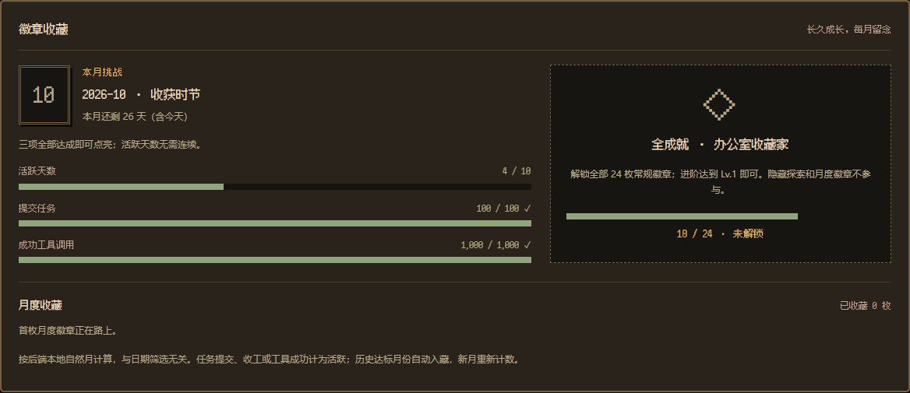
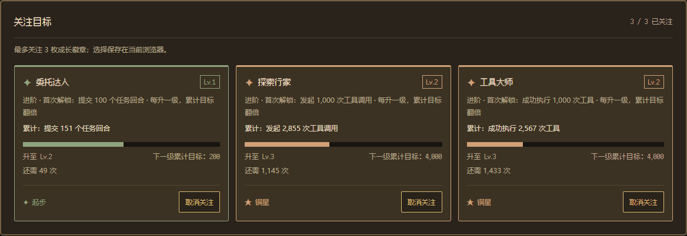
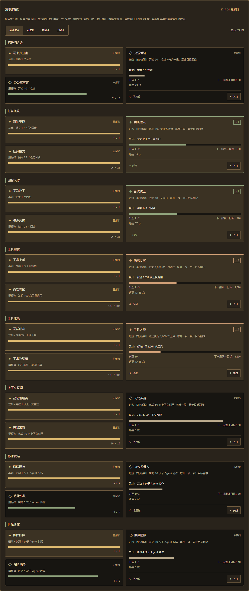
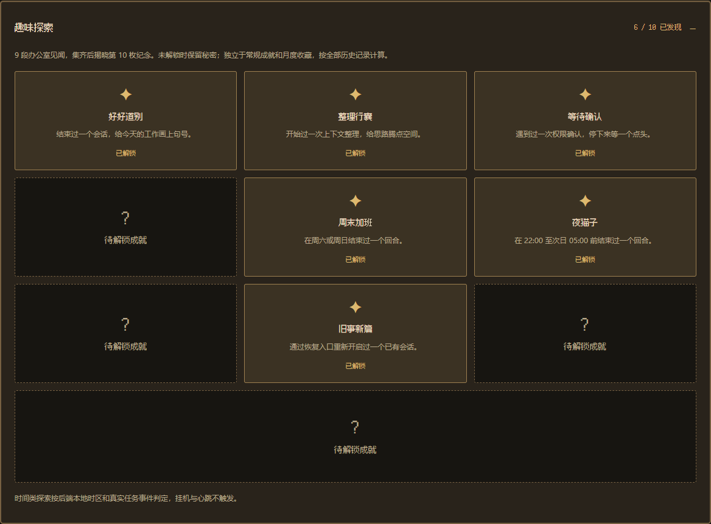

# Star Office UI · Codex 版

🌐 Language: **中文** | [English](./README.en.md) | [日本語](./README.ja.md)


**一个由 Codex hooks 驱动的像素办公室看板** —— 把 AI 助手的工作状态实时可视化，让你直观看到"谁在做什么、最近做了什么、现在是否在线"。

主界面是自适应全屏办公室，没有浏览器滚动条；点击底部办公室名称打开菜单，任务提示保留在房间左下角。支持多 Agent 协作、中英日切换、AI 生图装修和可选桌面宠物。
推荐通过 **Codex hooks** 自动驱动角色状态并记录会话、工具和子 Agent 活动；其他 AI Agent 也可通过脚本或 HTTP API 接入。

本项目基于 [ringhyacinth/Star-Office-UI](https://github.com/ringhyacinth/Star-Office-UI) 修改，当前开发与部署仓库为 [oiuv/Star-Office-UI](https://github.com/oiuv/Star-Office-UI)。

> 原项目由 **[Ring Hyacinth](https://x.com/ring_hyacinth)** 与 **[Simon Lee](https://x.com/simonxxoo)** 共同创建（co-created project），并与社区开发者（[@Zhaohan-Wang](https://github.com/Zhaohan-Wang)、[@Jah-yee](https://github.com/Jah-yee)、[@liaoandi](https://github.com/liaoandi)）一起持续维护和共建。
> 欢迎提交 Issue 和 PR，也感谢每一位贡献者的支持。

---

## ✨ 快速上手：Codex hooks（推荐）

完成以下三步，Codex 的任务开始、工具调用、上下文整理和本轮结束就会自动映射到办公室动画与活动记录。

> **环境要求：Python 3.10+**。以下示例使用 `python`；macOS / Linux 可按环境改为 `python3`。网页无需 Node.js 或前端构建；后端首次启动会初始化缺失的运行文件，已有状态与配置会保留。

### 1) 启动看板

```bash
git clone https://github.com/oiuv/Star-Office-UI.git
cd Star-Office-UI
python -m pip install -r backend/requirements.txt
python backend/app.py
```

打开 [http://127.0.0.1:19000](http://127.0.0.1:19000)。保持后端运行，另开终端进入 Star Office 项目根目录，继续配置 hooks。

### 2) 生成并启用 Codex hooks

```bash
python scripts/codex_hooks_config.py
```

把输出配置合并到你使用 Codex 的项目 `.codex/hooks.json`，或用户目录的 `~/.codex/hooks.json`（自定义 Codex 主目录时使用 `$CODEX_HOME/hooks.json`）。同一份办公室 hooks 只配置在一处，避免项目与全局重复执行；已有 hooks 应合并事件数组。然后在 Codex 中使用 `/hooks` 检查并信任配置。

生成的脚本路径为绝对路径，因此 Codex 可以在其他项目中调用这份办公室集成。Python 解释器需可访问；可用 `--python` 指定解释器路径。

### 3) 提交任务，查看动画与统计

在 Codex 中提交任务，办公室会自动显示工作状态；本轮结束或中断后恢复待命。打开 [活动档案](http://127.0.0.1:19000/stats) 查看事件、工具、会话、经验值与历史日志。

也可以让 AI 助手按本仓库的 [SKILL.md](./SKILL.md) 完成部署和 hooks 配置。

**活动档案预览**：与办公室统一的木色像素界面，展示活动概览、经验等级、状态分布、每日趋势和 12 类 hooks 统计。


---

## 🔌 Codex hooks 配置

主接入方式为 Codex hooks，采用 **6 种动画状态 + 12 种生命周期事件**。状态表示角色动作，事件表示触发原因；事件名称、描述、会话和工具标识分别记录，不需要增加 12 套动画。

### 配置说明

按快速上手生成配置；生成器只输出 JSON，不会修改现有文件。也可使用 [hooks.example.json](./integrations/codex/hooks.example.json)，替换其中的脚本路径。`--python` 可指定 Python 解释器；Windows 路径会加引号，支持空格。

配置使用中文 `statusMessage`，超时为 3 秒，`PostToolUse` 异步执行。提示文字仅用于 Codex 运行提示，角色状态与统计由事件内容决定。hooks 定义变更后需在 `/hooks` 重新审核，项目级配置还要求信任该项目；脚本只依赖 Python 标准库。

### 事件与动画状态

| Hook | 动画状态 | 展示含义 |
|------|----------|----------|
| SessionStart | idle；压缩后恢复前一状态 | 新会话 / 恢复会话 |
| UserPromptSubmit | researching | 理解任务 |
| PreToolUse | writing / researching / executing | 根据工具类型修改文件、查资料或执行 |
| PermissionRequest | idle | 等待执行权限；不会显示成报错 |
| PostToolUse | executing；明确失败时 error | 处理结果 / 工具失败 |
| PreCompact | syncing | 整理上下文 |
| PostCompact | 恢复压缩前状态 | 继续工作 |
| SubagentStart | 子角色 executing | 子 Agent 独立开始工作 |
| SubagentStop | 子角色 idle / 离线 | 子 Agent 本轮收尾 |
| Stop | idle | 主角色本轮结束 |
| Interrupt | idle | 中断，同时结束当前子角色的在线状态 |
| SessionEnd | idle | 会话结束 |

参考 [Codex 官方 hooks 文档](https://learn.chatgpt.com/docs/hooks)。脚本只观察事件，统一输出合法 JSON 空对象，不批准权限、不改写工具输入、不要求继续任务。脚本捕获异常后仍返回 `{}` 和退出码 0；超时可能显示 hook 失败提示，但本集成不主动阻断任务。

### 本地与远程模式

- **本地默认模式**：`codex_hook.py` 直接写 SQLite 与状态文件，无需启动 Flask 即可保存记录；启动后端后查看动画和历史。
- **远程模式**：Codex 进程环境设置 `STAR_OFFICE_URL`，例如 `https://your-office.example`；客户端与后端设置相同 `STAR_OFFICE_HOOK_TOKEN`。未设置 Token 时仅接受直接来自 loopback 的 hook 请求，反向代理部署应始终设置 Token。
- 默认数据库是 `data/office-events.sqlite3`，支持 `STAR_OFFICE_EVENTS_DB` 指定位置，数据库及 WAL/SHM 文件不会提交到 Git。备份时使用 SQLite 备份机制或停止写入后备份。
- `STAR_OFFICE_STATE_FILE` 可指定兼容状态文件位置。`STAR_OFFICE_HOOK_DEBUG=1` 仅将失败类别写到 stderr。
- **hook 活动记录**不保存 prompt、命令正文、完整工具输出、transcript 或 cwd；仅读取工具结果中的失败标记，保留事件名、工具名、会话/回合/子 Agent 标识及少量运行元数据。「最近小记」另行只读 Codex 总结文件。
- 远程上报超时或失败时跳过该次记录，不重试，也不回退到本地数据库；远程后端需保持在线。
- 异步 PostToolUse 迟到仍留日志，但不会复活已结束回合；多会话、子 Agent 分别记录。
- 五分钟未更新的状态回到待命。长工具调用可能暂时视为离线，直到下一次 hook；时长是保守观测值。

---

## 办公室怎么用

点击底部办公室名称展开菜单，点击空白处或按 `Esc` 关闭：

| 入口 | 功能 |
|------|------|
| 最近小记 | 读取本机 Codex 最近的会话总结，每次打开刷新 |
| 访客列表 | 查看自动加入的 Codex 子 Agent 和通过密钥接入的外部访客 |
| 装修房间 | 更换背景、管理素材与图片 API 配置 |
| 活动档案 | 打开 `/stats`，查看统计、日志、经验与成就 |
| 更多设置 | 切换语言、调整视野或手动切换角色状态 |

房间中的对话气泡从预设文案中按状态选择，不会调用模型，也不是 Agent 的原始对话。

### Codex 子 Agent 自动访客

- 收到带 `agent_id` 的 hook 后，按会话与子 Agent ID 创建独立角色，名称为 `Agent ` 加 ID 末 8 位；约 3.5 秒内在页面刷新显示。
- 子 Agent 独立更新自己的状态，不覆盖主角色小猫；不需要 join key 或 `office-agent-push.py`，不受外部访客密钥的并发数限制。
- `SubagentStop` 后显示为离线并回到休息区；最后一次事件超过 5 分钟后从房间和列表移除，历史活动仍保留。
- 父会话中断或结束时，其子 Agent 一并离线。多个 Codex 主会话接入时，主角色优先展示最近活跃的忙碌会话，其余会话作为访客显示。

---

## 📋 功能一览

1. **Codex hooks 自动接入** —— 12 种生命周期事件驱动动画与记录，支持会话、工具、上下文整理、中断和子 Agent
2. **活动档案与成长** —— 状态次数、观测时长、事件趋势、工具统计、筛选日志、JSON 导出，以及经验等级、24 枚常规成就、隐藏探索、全成就收藏与月度徽章
3. **状态可视化** —— 6 种状态（`idle` / `writing` / `researching` / `executing` / `syncing` / `error`）自动映射到办公室不同区域，动画 + 气泡实时展示
4. **最近小记** —— 读取 Codex 的最近 5 份会话总结，展示更新日期、项目、标题和任务完成情况
5. **多 Agent 协作** —— Codex 子 Agent 自动加入；外部 Agent 通过 join key 接入
6. **中英日三语** —— CN / EN / JP 一键切换，主要界面、气泡和加载提示联动；活动记录保留原始文案
7. **美术资产自定义** —— 侧边栏管理角色 / 场景 / 装饰素材，支持动画素材与帧规格管理
8. **AI 生图装修** —— 接入 OpenAI 兼容图片 API，默认使用 `gpt-image-2` 给办公室换背景；不接入 API 也能正常使用核心功能
9. **移动端适配** —— 手机直接打开即可查看，适合外出时快速瞄一眼
10. **安全加固** —— 侧边栏密码保护、生产环境弱密码拦截、Session Cookie 加固
11. **灵活公网访问** —— 推荐 Cloudflare Tunnel 一键公网化，也可用自有域名 / 反向代理
12. **桌面宠物版** —— 可选的 Electron 桌面封装，把办公室变成透明窗口的桌面宠物（见下方说明）

---

## 配置与运行检查

### 常用配置

直接执行 `python backend/app.py` **不会自动加载 `.env`**。`.env.example` 是配置参考，需由终端、服务管理器或部署工具注入环境变量。

| 变量 | 用途 |
|------|------|
| `STAR_BACKEND_PORT` | 后端端口，默认 `19000` |
| `CODEX_HOME` | 后端读取 Codex 总结的主目录，默认 `~/.codex` |
| `STAR_OFFICE_EVENTS_DB` | 活动数据库；本地 hooks 和后端需指向同一文件 |
| `STAR_OFFICE_STATE_FILE` | 兼容状态文件；本地 hooks 和后端需使用相同配置 |
| `STAR_OFFICE_URL` | 仅在 Codex 客户端设置；留空为本地记录，填写 URL 为远程上报 |
| `STAR_OFFICE_HOOK_TOKEN` | 远程 hooks 的共享 Token，客户端和后端保持一致 |
| `STAR_OFFICE_HOOK_DEBUG` | `1` 时向 stderr 输出 hook 失败类别 |
| `ASSET_DRAWER_PASS` | 装修验证码；本地默认 `1234` |
| `FLASK_SECRET_KEY` | Flask 会话签名密钥 |
| `STAR_OFFICE_ENV` | `production` 启用强密钥与装修密码启动检查 |

PowerShell 示例（设置后在同一终端启动后端）：

```powershell
$env:STAR_BACKEND_PORT = "19000"
$env:CODEX_HOME = "$env:USERPROFILE/.codex"
python backend/app.py
```

远程上报时，在**启动 Codex 的终端或应用环境**中设置：

```powershell
$env:STAR_OFFICE_URL = "https://your-office.example"
$env:STAR_OFFICE_HOOK_TOKEN = "替换为与后端一致的随机密钥"
```

macOS / Linux 使用 `export NAME=value`。修改环境后重启相关进程；修改首页 HTML 后也需重启后端，以刷新内存缓存。

### 验证与测试

在项目根目录执行：

```bash
python scripts/smoke_test.py --base-url http://127.0.0.1:19000
python -B -m unittest discover -s tests -v
node --test tests/test_stats.cjs tests/test_image_settings.cjs tests/test_speech_bubbles.cjs tests/test_recent_memo.cjs tests/test_desktop_window.cjs tests/test_desktop_backend.cjs tests/test_guest_positions.cjs
```

smoke 检查页面与读取接口，不推送测试状态或增加活动记录。自动化测试使用临时数据库和模拟图片接口，不消耗 API 额度；Node.js 仅用于前端测试或桌面壳开发。hooks 是否真正接入，仍需在 Codex 中提交一次任务并确认 `/stats` 出现对应事件。

### 公网访问（可选）

生产环境设置 `STAR_OFFICE_ENV=production`、强随机 `FLASK_SECRET_KEY`（至少 24 字符）与 `ASSET_DRAWER_PASS`（至少 8 字符）。装修验证码和 hook Token 只保护各自接口，**不是整个网站的访问密码**；活动档案和最近小记也会展示给能访问看板的人，公开部署请在网关设置访问控制。

已安装 Cloudflare Tunnel 时可使用：

```bash
cloudflared tunnel --url http://127.0.0.1:19000
```

---

## 🤝 其他 AI Agent 接入

任何能执行脚本或发送 HTTP 请求的 Agent 都可以使用原有接入方式。Codex hooks 已配置时，无需再添加手动状态同步规则。

### 状态自动同步

在 Agent 的规则文件中加入以下规则，让它主动调用 `set_state.py`；也可发送 `POST /set_state`，请求字段为 `state` 和 `detail`。在 Star Office 项目根目录执行脚本：

```markdown
## Star Office 状态同步规则
- 接到任务时：先执行 `python3 set_state.py <状态> "<描述>"` 再开始工作
- 完成任务后：执行 `python3 set_state.py idle "待命中"` 再回复
```

**访客的 6 种状态 → 3 个区域映射：**

| 状态 | 办公室区域 | 触发场景 |
|------|-----------|---------|
| `idle` | 🛋 休息区（沙发） | 待命 / 任务完成 |
| `writing` | 💻 工作区（办公桌） | 写代码 / 写文档 |
| `researching` | 💻 工作区 | 搜索 / 调研 |
| `executing` | 💻 工作区 | 执行命令 / 跑任务 |
| `syncing` | 💻 工作区 | 同步数据 / 推送 |
| `error` | 🐛 Bug 区 | 报错 / 异常排查 |

主角色使用专用动画，例如 `syncing` 对应上下文整理时的小猫睡觉动画。

状态推送同样进入活动档案，记录次数、描述和观测时长。会话、回合和工具等细分统计需要相应生命周期事件。

### 邀请其他 Agent 加入办公室

**Step 1：准备 join key**

首次启动后端时，如果仓库根目录下不存在 `join-keys.json`，服务会自动根据 `join-keys.sample.json` 生成一个运行时的 `join-keys.json`（内含示例 key，例如 `ocj_example_team_01`）。你可以在生成后的 `join-keys.json` 中自行添加、修改或删除 key，每个 key 的 `maxConcurrent` 默认值为 9，可自行调整；这不是整个办公室的访客总上限。实际分发前请替换公开的示例密钥。已有配置不会自动覆盖，如需调整请修改对应的 `maxConcurrent`。

- 主人不占访客名额；单个密钥接入 9 名普通访客时，加上主人共 10 人。Codex hooks 自动呈现的会话和子 Agent 不受此限制。
- 超过 5 分钟没有推送的普通访客不占在线名额，恢复推送时重新检查容量；满员返回 HTTP 429，推送脚本会在下次轮询重试。
- 名称可以重复。新版推送脚本持久化 `clientId`，用它和接入密钥识别同一客户端的重复加入；未传 `clientId` 的客户端每次加入都创建新访客。根目录测试脚本仍在每次启动时创建全新访客。
- `expiresAt` 可省略；支持 ISO 8601 本地时间、`Z` 或时区偏移（如 `2026-12-31T23:59:59+08:00`）。填写无效格式会返回明确错误。

**Step 2：让访客 Agent 运行推送脚本**

向访客分发 [`frontend/office-agent-push.py`](./frontend/office-agent-push.py)（也可从办公室 `/static/office-agent-push.py` 下载），安装 `requests` 并填写脚本顶部 3 个变量：

```python
JOIN_KEY = "你分配的密钥"          # 你分配的 key
AGENT_NAME = "小明的 Agent"            # 显示名称
OFFICE_URL = "https://your-office.example"  # 你的办公室地址
```

```bash
python -m pip install requests
python office-agent-push.py
```

脚本首次加入后缓存身份，每 15 秒推送一次访客本机的状态。建议用 `OFFICE_LOCAL_STATE_FILE` 明确指定客户端的 `state.json`；没有可用状态文件时，回退到 `OFFICE_LOCAL_STATUS_URL`（默认本机 `/status`），可配合 `OFFICE_LOCAL_STATUS_TOKEN`。本地 Agent 需持续更新状态来源，脚本不会从聊天内容中推断工作情况。

**根目录的同名脚本用于本机新访客测试**：从 `OFFICE_JOIN_KEY` 或忽略提交的 `office-agent.local.json` 读取密钥，每次运行生成「访客 + 随机名称」，不复用上次身份。不要将它当作稳定身份的访客分发脚本。

**Step 3（可选）：访客安装 Skill**

访客也可以把 `frontend/join-office-skill.md` 作为 Skill 使用，Agent 会自动完成配置和推送。

> 详细的访客接入说明见 [`frontend/join-office-skill.md`](./frontend/join-office-skill.md)

---

## 最近小记

点击办公室名称 →「最近小记」，查看当前后端账户的最近 5 份 Codex 会话总结，每份最多展示 3 项任务。
默认读取 `~/.codex/memories/rollout_summaries/*.md`；设置 `CODEX_HOME` 时读取该目录下的 `memories/rollout_summaries/`，路径支持 `~`。
按总结内的 `updated_at` 排序，显示后端本地日期；这表示总结更新时间，不代表所有任务都在当天完成。每次打开面板会重新读取。

这是该 Codex 主目录下跨项目的近期总结，不是按昨天筛选，也不是实时聊天记录。总结是否存在、何时更新由 Codex 决定；hooks 记录活动并不会立即生成 memory。

无需手写日记，也不调用图片或文本 API。办公室只读现有总结；未生成记录时显示「暂无 Codex 会话总结」。
远程部署时读取的是服务器上的文件，需要将目标 Codex 目录挂载到后端并设置 `CODEX_HOME`。
直接运行 `python backend/app.py` 时请在进程环境中设置变量，程序不会自动加载 `.env`。

## 📊 活动档案与成长

访问 [http://127.0.0.1:19000/stats](http://127.0.0.1:19000/stats)，或点击办公室的「活动档案」。

支持今日、近 7 天、近 30 天、全部的事件、会话、回合和工具统计，六类状态的次数与观测时长，十二类 hooks 计数，权限等待、中断、压缩、子 Agent、每日趋势、筛选日志，以及最新 200 条 JSON 导出。

工具耗时通过 `tool_use_id` 配对开始/结束；只有明确错误标记或非零退出码才计为失败。回合结束 +20 XP、工具成功 +2、子 Agent 收尾 +10，100 XP 升一级。重复回放同一回合/工具不会重复领奖，主动状态心跳不产生经验值；成就和月度徽章不额外发放 XP。

已有 `set_state.py`、`POST /set_state` 和 `POST /agent-push` 同样记录。页面轮询不增加事件，相同状态描述的重复推送标记为心跳。hook 接收次数和去重后的结束回合数分别展示，全部 12 类生命周期统计保留。

### 成就成长线

共 **24 枚常规成就**：8 条成长线，每条有“基础 → 里程碑 → 进阶”3 枚徽章。基础与里程碑只解锁一次，进阶按累计门槛翻倍无限升级。

| 成长线 | 基础（1 次） | 固定里程碑 | 进阶徽章 | Lv.1 / Lv.2 / Lv.3 累计门槛 |
| --- | --- | --- | --- | --- |
| 开始会话 | 初来办公室 | 办公室常客：10 次 | 资深常驻 | 50 / 100 / 200 |
| 提交任务 | 新的委托 | 任务接力：25 次 | 委托达人 | 100 / 200 / 400 |
| 结束回合 | 初次收工 | 稳步交付：25 次 | 百次收工 | 100 / 200 / 400 |
| 发起工具 | 工具上手 | 百次尝试：100 次 | 探索行家 | 1,000 / 2,000 / 4,000 |
| 工具成功 | 初试成功 | 工具熟练者：100 次 | 工具大师 | 1,000 / 2,000 / 4,000 |
| 整理完成 | 记忆管理员 | 思路常新：10 次 | 记忆典藏 | 50 / 100 / 200 |
| 协作启动 | 邀请搭档 | 组建小队：5 次 | 协作发起人 | 10 / 20 / 40 |
| 协作收尾 | 协作伙伴 | 配合渐佳：5 次 | 默契团队 | 10 / 20 / 40 |

会话结束、开始整理、权限确认、主动中断移入独立的隐藏探索，不影响常规成就收集；全部 12 类 hooks 仍正常记录和统计。

宽屏每条成长线左侧上下排列两枚固定徽章，右侧进阶卡片跨两行，两列总高度一致；窄屏按基础、里程碑、进阶依次纵向显示。已解锁、未解锁、可成长筛选会自动调整布局，不留下空位。

进阶 Lv.N 的累计门槛为 `首次门槛 × 2^(N−1)`。例如工具成功 2,338 次为 Lv.2，下一级要求累计 4,000 次，还需 1,662 次；升级进度是本级新增 338 / 2,000。Lv.2、3、5、7、10 对应铜星、银星、金星、星耀、传奇，之后等级继续增长。

成就使用办公室全部历史记录，不受日期筛选影响。工具按工具 ID、回合按回合 ID、会话按会话 ID 去重；上下文整理按独立事件 ID 计数，缺少业务 ID 时使用事件 ID。明确失败的工具结果不计入成功成就。

历史记录自动按新规则换算，XP 不清零。在“可成长”筛选中最多关注 3 枚进阶徽章，未解锁也可关注。选择保存在当前浏览器；旧关注“任务接力 / 百次尝试”分别迁移到同一成长线的“委托达人 / 探索行家”，已经关注的其他进阶徽章保留。

### 全成就与月度收藏

- **全成就 · 办公室收藏家**：24 枚常规徽章全部首次解锁后自动点亮，进阶达到 Lv.1 即可。隐藏探索和月度徽章均不参与，也不要求无限等级达到某个“终点”。
- **月度徽章**：每个月条件相同，当月同时达到 **活跃 10 天、提交 100 次任务（UserPromptSubmit）、成功执行 1,000 次工具** 即点亮。活跃天数无需连续；收到任务提交、回合结束或成功工具结果的日期算一个活跃日，多 Agent 同日只算一天，心跳和权限等待不算。
- 按**后端本地自然月**统计，不受“今日 / 近 7 天”等筛选影响。工具调用按工具 ID、任务提交按回合 ID 去重，跨月重复归于首次活动月份；未来时间的记录不提前计入。
- 每个月有独立年月与季节主题，例如十月“收获时节”。新月重新计数，已达成月份进入收藏；保留的历史记录会自动补亮已达标月份，迟到事件也能补记。收藏随活动数据库保存，备份时请包含 `data/office-events.sqlite3`。

### 趣味探索（隐藏成就）

独立设置 **9 枚隐藏探索 + 1 枚集齐奖励**，不参与常规成就计数、全成就收藏家或 XP。未达成只显示“待解锁成就”，不显示名称、条件、进度或提示；接口也只返回匿名位置与解锁状态。达成后自动揭晓名称和对应经历，全部 9 枚达成后点亮第 10 枚。

按办公室全部历史记录判断，日期筛选和后端重启不会重置；时间条件按后端本地时区计算，要求实际任务事件，挂机和心跳不触发。已有记录自动参与判定，无需重做。

<details>
<summary>维护说明：查看隐藏条件（含剧透）</summary>

| 隐藏探索 | 解锁条件 |
| --- | --- |
| 好好道别 | 结束 1 个会话（SessionEnd） |
| 整理行囊 | 开始 1 次上下文整理（PreCompact） |
| 等待确认 | 收到 1 次权限确认（PermissionRequest） |
| 适时暂停 | 主动中断 1 次（Interrupt） |
| 周末加班 | 周六或周日结束 1 个回合 |
| 夜猫子 | 22:00 至次日 05:00 前结束 1 个回合 |
| 晨光来客 | 05:00 至 08:00 前提交 1 个任务 |
| 旧事新篇 | 收到 source=resume 的 SessionStart，恢复已有会话 |
| 柳暗花明 | 同一角色、同一会话中，工具失败后成功完成另一工具调用 |
| 办公室探秘家 | 集齐前 9 枚隐藏探索 |

时间事件按活动标识去重，跨日重放不会重复触发。恢复会话依据恢复事件的元数据识别；工具失败后的成功必须来自更晚的另一工具调用，不跨角色或会话拼接。

</details>

日期按后端本地时区分组，Agent 时长累加，每次更新最多观测 300 秒；断联时间不无限累计。回合数表示收到 Stop，不代表任务质量。没有 Token 数据时不推算 Token 或费用。接入记录功能之前、数据库未保存的历史不会自动生成；绕过脚本手工修改状态文件不产生记录。

<details>
<summary>查看成就截图：月度收藏、关注目标与三阶段成长线</summary>







</details>

<details>
<summary>查看隐藏探索截图（含已解锁内容）</summary>



</details>

---

## 装修房间

点击门牌 →「装修房间」，输入装修验证码后使用：

| 入口 | 行为 |
|------|------|
| 搬新家 | 从 12 种内置主题中随机选择风格，调用图片 API 生成并替换房间背景 |
| 找中介 | 输入自己的风格描述，结合房间参考图生成背景 |
| 自己装 | 手动浏览、上传与替换背景、角色、装饰等素材 |
| 回老家 | 恢复默认房间背景，不调用图片 API |

支持「回上一个家」「收藏这个家」及恢复收藏。生图提示词要求保留布局，但实际效果取决于图片服务；只有生成操作需要图片 API。快速与精细使用同一模型：`gpt-image-*` 分别传 `quality=low` / `high`；自定义模型不强制这两个参数。生成完成后局部刷新房间。

## 🎨 OpenAI 兼容图片接口

在装修侧边栏的 API 设置中填写：

- **API 地址**：例如 `https://api.openai.com/v1` 或 `http://127.0.0.1:8000/v1`。包含服务所需的完整前缀，后端追加 `/images/edits` 或 `/images/generations`。
- **API Key**：保存后只显示末四位；留空保存会保留已有密钥。
- **图片模型**：填写服务实际支持的名称，允许自定义。
- **生成方式**：默认通过 multipart 上传参考图进行编辑。仅支持文生图的服务可明确选择「纯文生图」，布局保持效果相应改变。

服务必须支持 OpenAI **Image API**，只有 `/chat/completions` 的服务不能接入。支持 `data[].b64_json` 和 `data[].url` 返回方式，图片下载不附带 API Key。参考 [Image API 官方文档](https://developers.openai.com/api/docs/guides/image-generation)。

环境变量为 `OPENAI_API_KEY`、`AI_BASE_URL`（或 `OPENAI_BASE_URL`）、`AI_IMAGE_MODEL`、`AI_IMAGE_MODE`，文件/UI 的值优先。默认地址 `https://api.openai.com/v1`，默认模型 `gpt-image-2`，可按服务替换。

图片配置统一使用 `/config/ai`，运行配置字段为 `api_key`、`base_url`、`model`、`image_mode`。生图由项目内的 `backend/image_client.py` 直接调用服务，无需额外安装模型 SDK 或仓库外的生图 Skill。命令行入口为 `scripts/image_generate.py`。

---

## 📡 常用 API

| 端点 | 说明 |
|------|------|
| `POST /hooks/codex` | 接收 Codex hook 事件；远程使用 Bearer Token |
| `GET /api/stats?period=today` | 活动统计；支持 `today` / `7d` / `30d` / `all` |
| `GET /api/events?period=7d&limit=50` | 活动日志；`limit` 为 1–200，可加 `state` / `hook` 筛选 |
| `GET /health` | 健康检查 |
| `GET /status` | 获取主 Agent 状态 |
| `POST /set_state` | 设置主 Agent 状态 |
| `GET /agents` | 获取多 Agent 列表 |
| `POST /join-agent` | 访客加入办公室 |
| `POST /agent-push` | 访客推送状态 |
| `POST /leave-agent` | 访客离开 |
| `GET /recent-memo` | 获取最近的 Codex 会话总结（兼容旧 `/yesterday-memo` 路径） |
| `GET /config/ai` | 获取 OpenAI 图片 API 配置（Key 脱敏） |
| `POST /config/ai` | 设置 OpenAI 图片 API 配置 |
| `GET /assets/generate-rpg-background/poll` | 轮询生图进度 |

---

## 🖥 桌面宠物版（可选）

网页可直接使用，不需要桌面壳。Electron 版从仓库根目录运行：

```bash
cd electron-shell
npm ci
npm run dev
```

桌面壳复用 Python 后端，支持主窗口 / 迷你窗口切换和托盘；可用 `STAR_PROJECT_ROOT`、`STAR_BACKEND_PYTHON` 指定项目和解释器。详见 [Electron 说明](./electron-shell/README.md)。

[desktop-pet/](./desktop-pet/README.md) 保留实验性的 Tauri 版及其独立安装要求，主要在 macOS 上开发测试。感谢 [@Zhaohan-Wang](https://github.com/Zhaohan-Wang) 的桌面宠物贡献。浏览器首页与 `electron-standalone.html` 是分别维护的布局。

---

## 🎨 美术资产与开源许可

### 资产来源

访客角色动画使用了 **LimeZu** 的免费资产：

- [Animated Mini Characters 2 (Platformer) [FREE]](https://limezu.itch.io/animated-mini-characters-2-platform-free)

请在二次发布 / 演示时保留来源说明，并遵守原作者许可条款。

### 许可协议

- **代码 / 逻辑：MIT**（见 [`LICENSE`](./LICENSE)）
- **美术资产：禁止商用**（仅学习 / 演示 / 交流用途）

> 如需商用，请将所有美术资产替换为你自己的原创素材。

---

## 📁 项目结构

```text
Star-Office-UI/
├── backend/            # Flask 后端
│   ├── app.py
│   ├── hook_events.py     # 12 类 hooks 到 6 种状态的映射
│   ├── event_store.py     # 活动记录与统计
│   ├── achievements.py    # 成就里程碑、翻倍进阶、月度徽章与隐藏探索
│   ├── memo_utils.py      # 只读 Codex 会话总结
│   ├── image_client.py    # OpenAI 图片接口
│   ├── requirements.txt
│   └── run.sh
├── frontend/           # 前端页面与资产
│   ├── stats.html         # 活动档案
│   ├── index.html         # 浏览器全屏办公室
│   ├── electron-standalone.html # 桌面布局
│   ├── office-shell.js    # 门牌菜单与弹窗
│   ├── recent-memo.js     # 最近小记
│   ├── office-agent-push.py # 分发给访客的稳定身份脚本
│   ├── join.html
│   ├── invite.html
│   └── layout.js
├── desktop-pet/        # Tauri 桌面宠物版（可选）
├── electron-shell/     # Electron 桌面壳（可选）
├── tests/              # Python / Node 回归测试
├── data/               # 本地活动数据库（不提交）
├── docs/               # 文档与截图
│   └── screenshots/
├── office-agent-push.py  # 本机随机新访客测试脚本
├── set_state.py          # 状态切换脚本
├── state.sample.json     # 状态文件模板
├── join-keys.sample.json # Join Key 模板（启动时生成 join-keys.json）
├── codex_hook.py         # Codex hooks 事件适配
├── integrations/codex/   # hooks 配置示例
├── scripts/              # hooks 配置生成器与图片生成 CLI
├── SKILL.md              # 通用 Agent 部署指南
└── LICENSE               # MIT 许可
```
